# DLD to Cursor AI Prompt Generation System

A sophisticated multi-agent architecture for converting 5G base station Design Low-Level Documents (DLD) into optimized Cursor AI prompts.

## 🚀 Overview

This system transforms complex 5G telecommunications DLD documents into high-quality, actionable prompts specifically optimized for Cursor AI code generation. It leverages a multi-agent pipeline with domain expertise, quality assurance, and continuous improvement capabilities.

## 🏗️ System Architecture


## 📊 Data Flow Architecture

```mermaid
sequenceDiagram
    participant User as 👤 사용자
    participant API as 🌐 REST API
    participant Master as 🎯 Master Agent
    participant Context as 🔍 Context Validation
    participant Prompt as ⚙️ Prompt Generator
    participant Quality as 🛡️ Quality Agent
    participant LLM as 🧠 LLM Integration
    participant Output as 📤 Output Agent
    participant Feedback as 🔄 Feedback Loop
    participant KB as 📚 Knowledge Base
    
    User->>API: DLD 문서 업로드
    API->>Master: 처리 요청
    
    Note over Master: 1단계: Context Validation
    Master->>Context: DLD 검증 시작
    Context->>KB: 5G 용어 검증 요청
    KB-->>Context: 도메인 온톨로지 반환
    Context->>KB: 검증 규칙 조회 요청
    KB-->>Context: 검증 규칙 반환
    Context->>KB: 일관성 기준 조회 요청
    KB-->>Context: 일관성 기준 반환
    Context->>Context: 구조 분석 + 일관성 검증
    Context-->>Master: 검증 결과
    
    Note over Master: 2단계: Prompt Generation
    Master->>Prompt: 6단계 프롬프트 생성
    Prompt->>KB: 프롬프트 템플릿 요청
    KB-->>Prompt: 템플릿 반환
    Prompt->>KB: 코딩 패턴 요청
    KB-->>Prompt: 패턴 라이브러리 반환
    Prompt->>KB: 5G 도메인 지식 요청
    KB-->>Prompt: 도메인 지식 반환
    Prompt->>Prompt: 0-6단계 순차 실행
    Prompt-->>Master: 생성된 프롬프트
    
    Note over Master: 3단계: Quality Assurance
    Master->>Quality: 품질 검증
    Quality->>KB: 완성도 기준 요청
    KB-->>Quality: 완성도 기준 반환
    Quality->>KB: 기술적 정확성 기준 요청
    KB-->>Quality: 기술적 정확성 기준 반환
    Quality->>KB: Cursor AI 호환성 기준 요청
    KB-->>Quality: 호환성 기준 반환
    Quality->>Quality: 완성도 + 정확성 + 호환성 검증
    Quality-->>Master: 품질 점수
    
    Note over Master: 4단계: LLM Optimization
    Master->>LLM: GPT-5 최적화
    LLM->>LLM: 프롬프트 최적화
    LLM-->>Master: 최적화된 프롬프트
    
    Note over Master: 5단계: Output Processing
    Master->>Output: 최종 처리
    Output->>Output: 구조화 + 형식 변환
    Output-->>Master: 최종 결과
    
    Note over Master: 6단계: Feedback Collection
    Master->>Feedback: 성능 분석
    Feedback->>KB: 성공 사례 저장 요청
    KB-->>Feedback: 저장 완료
    Feedback->>Feedback: 품질 분석 + 개선사항 식별
    Feedback-->>Master: 피드백 데이터
    
    Master-->>API: 처리 완료
    API-->>User: 최적화된 Cursor AI 프롬프트
```



## 🔄 6-Step Prompt Generation Pipeline

```mermaid
graph TD
    subgraph "🔍 Step 0: Project Analysis"
        PA1[📁 Directory Scanning]
        PA2[🔗 Dependency Mapping] 
        PA3[🏛️ Architecture Identification]
    end
    
    subgraph "📄 Step 1: DLD Processing"
        DP1[🔧 Tech Spec Extraction]
        DP2[📊 Requirement Classification]
        DP3[📝 Markdown Conversion]
        DP4[💻 Pseudocode Identification]
    end
    
    subgraph "🧠 Step 2: System Context"
        SC1[📡 5G Domain Knowledge]
        SC2[👨‍💻 Coding Guidelines]
        SC3[⭐ Quality Standards]
    end
    
    subgraph "🤖 Step 3: Cursor AI Rules"
        CAR1[👥 Team Conventions]
        CAR2[📏 Project Rules]
        CAR3[🤖 AI Guidelines]
    end
    
    subgraph "🔄 Step 4: Code Mapping"
        CM1[🔄 DLD-Code Matching]
        CM2[🏷️ Function Mapping]
        CM3[📦 Module Analysis]
    end
    
    subgraph "🎨 Step 5: Style Extraction"
        SE1[🎨 Code Patterns]
        SE2[📝 Naming Conventions]
        SE3[🏗️ Architecture Style]
        SE4[🧪 Test Patterns]
    end
    
    subgraph "⚡ Step 6: Context Enhancement"
        CE1[📡 5G Protocol Knowledge]
        CE2[⚙️ Hardware Constraints]
        CE3[⚡ Performance Requirements]
    end
    
    subgraph "📚 Knowledge Base Calls"
        KB1[📚 프롬프트 템플릿]
        KB2[📚 코딩 패턴]
        KB3[📚 5G 도메인 지식]
    end
    
    PA1 --> PA2 --> PA3
    PA3 --> DP1
    DP1 --> DP2 --> DP3 --> DP4
    DP4 --> SC1
    SC1 --> SC2 --> SC3
    SC3 --> CAR1
    CAR1 --> CAR2 --> CAR3
    CAR3 --> CM1
    CM1 --> CM2 --> CM3
    CM3 --> SE1
    SE1 --> SE2 --> SE3 --> SE4
    SE4 --> CE1
    CE1 --> CE2 --> CE3
    
    %% Knowledge Base 호출
    SC1 -.->|호출| KB1
    SE1 -.->|호출| KB2
    CE1 -.->|호출| KB3
    
    CE3 --> FINAL[📋 최종 프롬프트 생성]
    
    %% 스타일링
    classDef step fill:#e3f2fd,stroke:#0277bd,stroke-width:2px
    classDef knowledge fill:#fce4ec,stroke:#880e4f,stroke-width:2px
    classDef call stroke:#e91e63,stroke-width:3px,stroke-dasharray: 5 5
    
    class PA1,PA2,PA3,DP1,DP2,DP3,DP4,SC1,SC2,SC3,CAR1,CAR2,CAR3,CM1,CM2,CM3,SE1,SE2,SE3,SE4,CE1,CE2,CE3,FINAL step
    class KB1,KB2,KB3 knowledge
```

## 📈 Quality Assurance Matrix

```mermaid
graph TD
    subgraph "🛡️ Quality Dimensions"
        QD1[📋 Completeness<br/>완성도 검증]
        QD2[🔬 Technical Accuracy<br/>기술적 정확성]
        QD3[🤖 Cursor AI Compatibility<br/>호환성 검증]
        QD4[💡 Clarity<br/>명확성 평가]
        QD5[🎯 Specificity<br/>구체성 측정]
        QD6[⚡ Actionability<br/>실행 가능성]
    end
    
    subgraph "📚 Knowledge Base Calls"
        KB1[📚 완성도 기준]
        KB2[📚 기술적 정확성 기준]
        KB3[📚 Cursor AI 호환성 기준]
        KB4[📚 명확성 기준]
        KB5[📚 구체성 기준]
        KB6[📚 실행 가능성 기준]
    end
    
    subgraph "📊 Scoring System"
        S1[가중치 계산]
        S2[임계값 비교]
        S3[전체 점수 산출]
    end
    
    subgraph "💡 Improvement Engine"
        IE1[문제점 식별]
        IE2[개선 제안]
        IE3[우선순위 지정]
    end
    
    %% Knowledge Base 호출
    QD1 -.->|호출| KB1
    QD2 -.->|호출| KB2
    QD3 -.->|호출| KB3
    QD4 -.->|호출| KB4
    QD5 -.->|호출| KB5
    QD6 -.->|호출| KB6
    
    QD1 --> S1
    QD2 --> S1
    QD3 --> S1
    QD4 --> S1
    QD5 --> S1
    QD6 --> S1
    
    S1 --> S2 --> S3
    S3 --> IE1 --> IE2 --> IE3
    
    %% 스타일링
    classDef quality fill:#e3f2fd,stroke:#0277bd,stroke-width:2px
    classDef knowledge fill:#fce4ec,stroke:#880e4f,stroke-width:2px
    classDef scoring fill:#f1f8e9,stroke:#33691e,stroke-width:2px
    classDef improvement fill:#fff3e0,stroke:#e65100,stroke-width:2px
    classDef call stroke:#e91e63,stroke-width:3px,stroke-dasharray: 5 5
    
    class QD1,QD2,QD3,QD4,QD5,QD6 quality
    class KB1,KB2,KB3,KB4,KB5,KB6 knowledge
    class S1,S2,S3 scoring
    class IE1,IE2,IE3 improvement
```

## 🧩 Component Architecture

```mermaid
graph LR
    subgraph "🎯 Core System"
        direction TB
        MA[Master Agent]
        CVA[Context Validation Agent]
        PGA[Prompt Generator Agent] 
        CQA[Code Quality Agent]
        LLM[LLM Integration]
        POA[Prompt Output Agent]
        FL[Feedback Loop]
    end
    
    subgraph "📚 Knowledge Layer"
        direction TB
        KM[Knowledge Manager]
        DO[5G Domain Ontology]
        CP[Coding Patterns]
        PT[Prompt Templates]
        SC[Success Cases]
    end
    
    subgraph "🔧 Infrastructure"
        direction TB
        API[REST API]
        CFG[Configuration]
        LOG[Logging]
        DOC[Docker]
    end
    
    subgraph "📊 Data Flow"
        direction LR
        DLD[DLD Input] --> PROMPT[Optimized Prompt]
        METRICS[Quality Metrics] --> FEEDBACK[Improvement Suggestions]
    end
    
    %% Agent to Knowledge Base 호출 관계
    CVA -.->|호출| KM
    PGA -.->|호출| KM
    CQA -.->|호출| KM
    FL -.->|호출| KM
    
    MA --> CVA
    MA --> PGA
    MA --> CQA
    MA --> LLM
    MA --> POA
    MA --> FL
    
    KM --> DO
    KM --> CP
    KM --> PT
    KM --> SC
    
    API --> MA
    CFG --> MA
    LOG --> MA
```



## ✨ Key Features

### 🤖 Multi-Agent Pipeline
- **Context Validation Agent**: DLD verification and preprocessing
- **Prompt Generator Agent**: 6-step prompt generation pipeline
- **Code Quality Agent**: Technical accuracy and compatibility validation
- **LLM Integration**: GPT-5 prompt optimization
- **Prompt Output Agent**: Multi-format output processing
- **Feedback Loop**: Performance monitoring and system improvement

### 🔧 6-Step Prompt Generation Pipeline
1. **Project Code Structure Analysis**: Directory scanning, dependency mapping, architecture identification
2. **DLD Parsing and Conversion**: Technical spec extraction, requirement classification, markdown conversion
3. **System Prompt Loading**: 5G domain knowledge, coding guidelines, quality standards
4. **Cursor AI Rules Integration**: Team conventions, project rules, AI utilization guidelines
5. **Code Mapping Analysis**: DLD-code matching, function mapping, module structure analysis
6. **Context Enhancement**: 5G protocol knowledge, hardware constraints, performance requirements

### 📊 Knowledge Base Integration
- **5G Domain Ontology**: Comprehensive 5G technical knowledge
- **Coding Pattern Library**: Reusable implementation patterns
- **Prompt Template Repository**: Proven prompt structures
- **Success Case Database**: Historical performance data

### 🎯 Quality Assurance
- **Technical Accuracy Validation**: 5G domain expertise verification
- **Cursor AI Compatibility**: Optimization for AI code generation
- **Completeness Assessment**: Requirement coverage analysis
- **Performance Benchmarking**: Quality metrics and improvements

## 📦 Installation

### Prerequisites
- Python 3.11+
- Docker (optional)
- OpenAI API Key

### Local Development Setup

1. **Clone the repository**:
```bash
git clone <repository-url>
cd dld-cursor-ai-prompt-generator
```

2. **Install dependencies**:
```bash
pip install -r requirements.txt
```

3. **Set up environment variables**:
```bash
cp env.example .env
# Edit .env with your OpenAI API key and other configurations
```

4. **Initialize knowledge base**:
```bash
mkdir -p knowledge_base/data
mkdir -p logs
```

5. **Run the application**:
```bash
python main.py
```

### Docker Deployment

1. **Build and run with Docker Compose**:
```bash
docker-compose up -d
```

2. **Check service health**:
```bash
curl http://localhost:8000/health
```

## 🚀 Usage

### REST API

#### Process DLD Document
```bash
curl -X POST "http://localhost:8000/process-dld" \
  -H "Content-Type: application/json" \
  -d '{
    "dld_content": "Your DLD document content here...",
    "project_path": "/path/to/existing/project",
    "output_format": "cursor_ai",
    "quality_threshold": 0.8
  }'
```

#### Upload DLD File
```bash
curl -X POST "http://localhost:8000/upload-dld" \
  -F "file=@your_dld_document.docx" \
  -F "project_path=/path/to/project" \
  -F "output_format=cursor_ai"
```

#### Health Check
```bash
curl http://localhost:8000/health
```

#### Knowledge Base Statistics
```bash
curl http://localhost:8000/knowledge-stats
```

### Example Response

```json
{
  "success": true,
  "prompt": "# 5G gNodeB Implementation...",
  "quality_score": 0.92,
  "validation_results": {
    "completeness_score": 0.89,
    "consistency_score": 0.95,
    "missing_sections": [],
    "technical_accuracy": 0.94
  },
  "execution_time": 45.2,
  "export_formats": {
    "cursor_ai_md": "...",
    "plain_text": "...",
    "structured_json": "..."
  }
}
```

## 📝 Configuration

### Main Configuration (`config.yaml`)

```yaml
# System Settings
debug: false
log_level: "INFO"
max_concurrent_requests: 10

# LLM Configuration
llm:
  provider: "openai"
  model: "gpt-4"
  max_tokens: 4000
  temperature: 0.7

# Quality Thresholds
quality_thresholds:
  dld_completeness: 0.8
  technical_accuracy: 0.9
  prompt_effectiveness: 0.85
```

### Environment Variables

Key environment variables (see `env.example`):

- `OPENAI_API_KEY`: Your OpenAI API key
- `LOG_LEVEL`: Logging level (DEBUG, INFO, WARNING, ERROR)
- `MAX_CONCURRENT_REQUESTS`: Maximum concurrent request limit
- `KNOWLEDGE_BASE_PATH`: Path to knowledge base data

## 🏗️ Architecture Details

### Master Agent
The orchestrator that coordinates all sub-agents and manages the processing pipeline.

### Context Validation Agent
- **DLD Structure Analysis**: Parses document structure and identifies sections
- **Missing Information Detection**: Identifies gaps in requirements or specifications
- **Consistency Verification**: Checks for contradictions and inconsistencies

### Prompt Generator Agent
Implements the 6-step pipeline:
1. **Project Analysis**: Scans existing codebase structure
2. **DLD Processing**: Extracts and classifies requirements
3. **System Context**: Loads 5G domain knowledge
4. **Cursor AI Integration**: Applies AI-specific optimizations
5. **Code Mapping**: Maps DLD to existing implementations
6. **Enhancement**: Adds domain-specific context

### Code Quality Agent
- **Completeness Verification**: Ensures all requirements are addressed
- **Technical Accuracy**: Validates 5G domain correctness
- **Cursor AI Compatibility**: Optimizes for AI code generation

### Knowledge Base
- **5G Domain Ontology**: Network functions, interfaces, protocols, technologies
- **Coding Patterns**: Reusable implementation templates
- **Prompt Templates**: Proven prompt structures
- **Success Cases**: Historical performance data

## 📊 Monitoring and Analytics

### Performance Metrics
- Execution time per component
- Quality scores over time
- Success rates and trends
- System health indicators

### Quality Assessment
- Technical accuracy scores
- Completeness measurements
- Cursor AI compatibility ratings
- User feedback integration

### Feedback Loop
- Continuous performance monitoring
- Automatic improvement identification
- Recommendation generation
- Historical trend analysis

## 🔧 Development

### Project Structure
```
dld-cursor-ai-prompt-generator/
├── agents/                     # Multi-agent system components
│   ├── master_agent.py        # Main orchestrator
│   ├── context_validation_agent.py
│   ├── prompt_generator_agent.py
│   ├── code_quality_agent.py
│   ├── llm_integration.py
│   ├── prompt_output_agent.py
│   └── feedback_loop.py
├── knowledge_base/            # Knowledge management
│   ├── knowledge_manager.py
│   └── data/                  # Knowledge storage
├── utils/                     # Utilities
│   ├── config.py
│   └── logger.py
├── main.py                    # FastAPI application
├── requirements.txt
├── config.yaml
├── docker-compose.yml
└── Dockerfile
```

### Adding New Agents

1. Create new agent class inheriting from base agent pattern
2. Implement required methods: `initialize()`, `shutdown()`, main processing method
3. Register agent in `MasterAgent`
4. Add configuration in `config.yaml`

### Extending Knowledge Base

1. Add new knowledge categories in `KnowledgeManager`
2. Create data files in `knowledge_base/data/`
3. Implement search and retrieval methods
4. Update domain ontology if needed

## 🧪 Testing

### Unit Tests
```bash
python -m pytest tests/unit/
```

### Integration Tests
```bash
python -m pytest tests/integration/
```

### Performance Tests
```bash
python -m pytest tests/performance/
```

## 📈 Performance Optimization

### Recommendations
1. **Caching**: Implement Redis for knowledge base caching
2. **Parallel Processing**: Use asyncio for concurrent agent execution
3. **Memory Management**: Optimize large document processing
4. **API Optimization**: Implement rate limiting and request queuing

### Scaling
- **Horizontal Scaling**: Deploy multiple instances behind load balancer
- **Database Integration**: Use PostgreSQL for large-scale knowledge storage
- **Message Queues**: Implement async processing with Celery/RQ

## 🤝 Contributing

1. Fork the repository
2. Create feature branch (`git checkout -b feature/amazing-feature`)
3. Commit changes (`git commit -m 'Add amazing feature'`)
4. Push to branch (`git push origin feature/amazing-feature`)
5. Open Pull Request

### Development Guidelines
- Follow PEP 8 style guide
- Add unit tests for new features
- Update documentation
- Use type hints
- Implement proper error handling

## 📄 License

This project is licensed under the MIT License - see the [LICENSE](LICENSE) file for details.

## 🙋‍♂️ Support

### Documentation
- [API Documentation](docs/api.md)
- [Architecture Guide](docs/architecture.md)
- [Configuration Reference](docs/configuration.md)
- [Deployment Guide](docs/deployment.md)

### Community
- [Issues](../../issues)
- [Discussions](../../discussions)
- [Contributing Guidelines](CONTRIBUTING.md)

## 🔄 Changelog

### Version 1.0.0
- Initial release with complete multi-agent pipeline
- 5G domain knowledge integration
- Cursor AI optimization
- Performance monitoring and feedback loop
- REST API with comprehensive endpoints
- Docker deployment support

## 🚧 Roadmap

### Version 1.1.0
- [ ] Advanced NLP processing for DLD analysis
- [ ] Machine learning-based quality prediction
- [ ] Interactive web UI
- [ ] Batch processing capabilities

### Version 1.2.0
- [ ] Multi-language support
- [ ] Custom domain adaptation
- [ ] Advanced analytics dashboard
- [ ] API versioning and backwards compatibility

### Version 2.0.0
- [ ] AI-powered agent optimization
- [ ] Real-time collaboration features
- [ ] Enterprise security features
- [ ] Advanced deployment options
